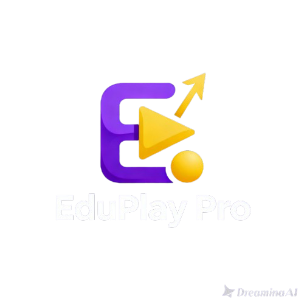

# EduPlay Pro 🎓

[](https://opensource.org/licenses/MIT)
[](https://www.python.org/downloads/)
[](https://pypi.org/project/PySide6/)
[](https://github.com/Tan0807-creat3/EduPlay.git)

**Project ID: 5809**

EduPlay Pro is a comprehensive, AI-powered interactive quiz creation tool designed for educators. Create engaging educational content with multiple quiz types, AI assistance, and professional export options.



📧 **Contact:** eduplay.vn@hotmail.com  
🔗 **Repository:** https://github.com/Tan0807-creat3/EduPlay.git

## ✨ Features

### 🎯 Dual Creation Modes
- **Manual Mode**: Full control over question creation with drag-and-drop reordering
- **AI Mode**: Automatic quiz generation using Puter.js v2 API

### 📝 Quiz Types
- **Multiple Choice**: Traditional quiz with 2-4 options
- **Matching**: Connect related pairs
- **Fill in the Blank**: Complete sentences
- **Crossword**: Word puzzles
- **GuessIt!**: Guess from hints
- **Mini Game 2D**: Interactive educational games

### 🚀 Key Capabilities
- ✅ Drag-and-drop question reordering
- ✅ Multi-media support (images, videos, audio)
- ✅ Special symbol insertion (math, science, Greek letters)
- ✅ Document import (Word, Excel, Text files)
- ✅ Real-time interactive preview
- ✅ HTML/EXE export with complete media package
- ✅ Project save/load functionality

## 📋 Requirements

- Python 3.8 or higher
- Windows OS (tested on Windows 10/11)

## 🔧 Installation

1. **Clone or download** this repository

2. **Install dependencies**:
   ```bash
   pip install -r requirements.txt
   ```

3. **Run the application**:
   ```bash
   python main.py
   ```

## 📖 Usage Guide

### Getting Started

1. **Launch the application**
2. **Choose your mode** (Manual or AI) in the left panel
3. **Select quiz types** you want to include
4. **Create questions** using the center panel
5. **Preview** in real-time on the right panel
6. **Save or Export** using the footer buttons

### Manual Mode

**Creating Questions:**
1. Click **"➕ Add Question"** to add a new row
2. Fill in the question, options, correct answer, and explanation
3. Select the question type from the dropdown
4. Upload media files if needed
5. Insert special symbols using the **"∑ Special Symbols"** button

**Reordering Questions:**
- Simply drag and drop rows to reorder questions

**Importing from Documents:**
1. Click **"📄 Import Document"**
2. Select your Word (.docx) or Excel (.xlsx) file
3. Questions will be automatically parsed and loaded

**Expected Document Format:**

For **Excel** files:
| Column | Content |
|--------|---------|
| A | Question |
| B | Option 1 |
| C | Option 2 |
| D | Option 3 |
| E | Option 4 |
| F | Correct Answer |
| G | Explanation |
| H | Type |

For **Word** documents:
```
1. Question text here?
A) Option 1
B) Option 2
C) Option 3
D) Option 4
Answer: A
Explanation: Why this is correct

2. Next question...
```

### AI Mode

1. Enter your **topic** and **subject**
2. Select **grade level**
3. Set **number of questions** and **difficulty**
4. Add any **special requirements**
5. Click **"🤖 Generate Quiz with AI"**
6. Review and edit generated questions

**Special Requirements Examples:**
- "Include multimedia elements"
- "Focus on historical events from 1900-1950"
- "Add mini games for interactive learning"
- "Use mathematical symbols and equations"

### Preview & Testing

- Click any question row to select it
- Click **"👁️ Preview Selected"** to see it in action
- The preview panel shows exactly how students will experience the question
- Interact with the preview to test functionality

### Saving Projects

**Save Project** (💾):
- Saves as `.edu` file with associated media folder
- Can be reopened for editing
- Format: `ProjectName.edu` + `ProjectName_media/` folder

**Project Structure:**
```
MyQuiz.edu
MyQuiz_media/
  ├── image1.png
  ├── audio1.mp3
  └── video1.mp4
```

### Exporting Quizzes

**HTML Export** (🌐):
Creates a complete web package:
```
QuizName_YYYYMMDD_HHMM/
  ├── index.html      (Main quiz player)
  ├── quiz.json       (Question data)
  ├── media/          (All media files)
  │   ├── image1.png
  │   └── audio1.mp3
  └── README.txt      (Instructions)
```

**Features:**
- Fully self-contained
- Works offline
- Compatible with all modern browsers
- Can be hosted online
- Mobile-friendly responsive design

**EXE Export** (💻):
- Prepares files for Electron packaging
- Same structure as HTML export
- Can be converted to Windows executable
- Professional standalone application

## 🎮 Interactive Preview Features

The right panel provides a fully interactive preview:

- **Multiple Choice**: Click answers to see feedback
- **Timer**: Countdown timer simulation
- **Score**: Points calculation
- **Explanations**: Show/hide answer explanations
- **Media**: Images, videos, and audio playback
- **Animations**: Smooth transitions and effects

## 🎨 Customization

### Themes
The application uses a modern gradient theme with:
- Purple-blue gradient header
- Clean white panels
- Smooth transitions
- Professional typography

### Special Symbols
Access hundreds of special symbols:
- **Math**: √, ∑, ∫, ∞, ±, ×, ÷
- **Greek**: α, β, γ, δ, π, Σ, Ω
- **Arrows**: →, ←, ⇒, ⇔
- **Logic**: ∈, ∩, ∪, ∀, ∃
- **Misc**: ★, ♠, ♥, ✓, ✗

## 🤖 AI Integration

EduPlay Pro uses Puter.js v2 API for AI generation:
- Intelligent question creation
- Context-aware answer generation
- Difficulty-appropriate content
- Automatic explanation generation
- Media suggestions

**Note**: AI features require an API key. The application includes fallback mock generation for testing without an API key.

## 📁 Project Structure

```
EduPlay-pro/
├── assets/
│   └── icon.png            # Application icon
├── ui/
│   ├── main_window.py      # Main application window
│   ├── header_widget.py    # Header with status bar
│   ├── footer_widget.py    # Footer with action buttons
│   ├── left_panel.py       # Mode and quiz type selection
│   ├── center_panel.py     # Question creation interface
│   ├── right_panel.py      # Interactive preview
│   ├── dialogs.py          # All dialog windows
│   └── styles.qss          # Application stylesheet
├── utils/
│   ├── project_manager.py  # Project save/load
│   ├── export_manager.py   # HTML/EXE export
│   ├── ai_generator.py     # AI quiz generation
│   └── document_parser.py  # Document import
├── main.py                 # Application entry point
├── requirements.txt        # Python dependencies
└── README.md              # This file
```

## 🔑 Keyboard Shortcuts

- **Ctrl+S**: Save project
- **Ctrl+O**: Open project
- **Ctrl+E**: Export project
- **F1**: Show help dialog

## 🐛 Troubleshooting

### Media Files Not Displaying
- Ensure media files exist at the specified path
- Supported formats: PNG, JPG, MP4, WebM, MP3, WAV, OGG
- Check file permissions

### Import Not Working
- Verify file format (.docx, .xlsx, .txt)
- Check document structure matches expected format
- Ensure python-docx and openpyxl are installed

### Preview Not Loading
- If QtWebEngine is not available, preview will show a placeholder
- Install PyQt6-WebEngine: `pip install PyQt6-WebEngine`

### AI Generation Fails
- Check internet connection
- Verify API key configuration
- The app will fall back to mock generation

## 📝 Tips & Best Practices

1. **Save Frequently**: Use Ctrl+S to save your work regularly
2. **Test Questions**: Always preview before exporting
3. **Organize Media**: Keep media files in a dedicated folder
4. **Use AI Wisely**: Generate with AI, then refine manually
5. **Backup Projects**: Keep backup copies of important quizzes
6. **Document Format**: Use consistent formatting for easier import

## 🚀 Advanced Features

### Drag-and-Drop Reordering
Click and drag question rows to reorder them. The table automatically renumbers questions.

### Multi-Media Support
Add multiple media types:
- **Images**: Visual questions, diagrams, charts
- **Audio**: Pronunciation, music, sound effects
- **Video**: Demonstrations, explanations

### Export Optimization
Exported HTML includes:
- Minified and optimized code
- Responsive design for all devices
- Offline functionality
- Progress tracking
- Score calculation
- Timer functionality

## 📜 License

This project is licensed under the MIT License.

## 📞 Support

For questions, issues, or feature requests:
- GitHub Repository: https://github.com/Tan0807-creat3/EduPlay.git
- Create an issue on GitHub
- Email: eduplay.vn@hotmail.com

## 🙏 Acknowledgments

- Built with PySide6 for the UI framework
- AI powered by Puter.js v2 API (https://js.puter.com/v2/)
- Icons and design inspired by modern educational tools

## 📊 Version History

### Version 1.0.0 (Current)
- ✅ Complete quiz creation interface
- ✅ Manual and AI modes
- ✅ 6 quiz types supported
- ✅ Document import functionality
- ✅ Interactive preview
- ✅ HTML/EXE export
- ✅ Project save/load
- ✅ Special symbols support

---

**Made with ❤️ for educators worldwide**

Project ID: 5809 | EduPlay Pro © 2025
